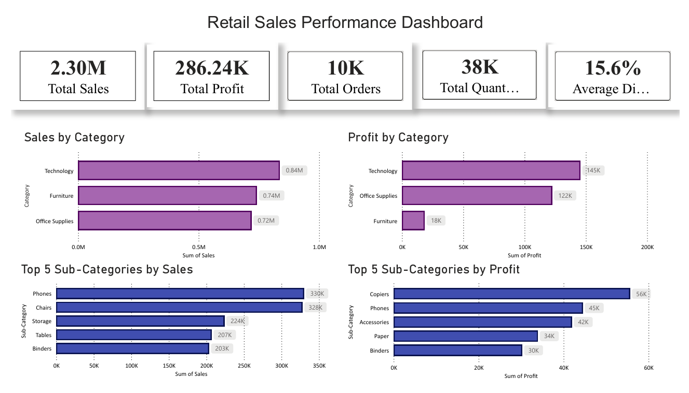
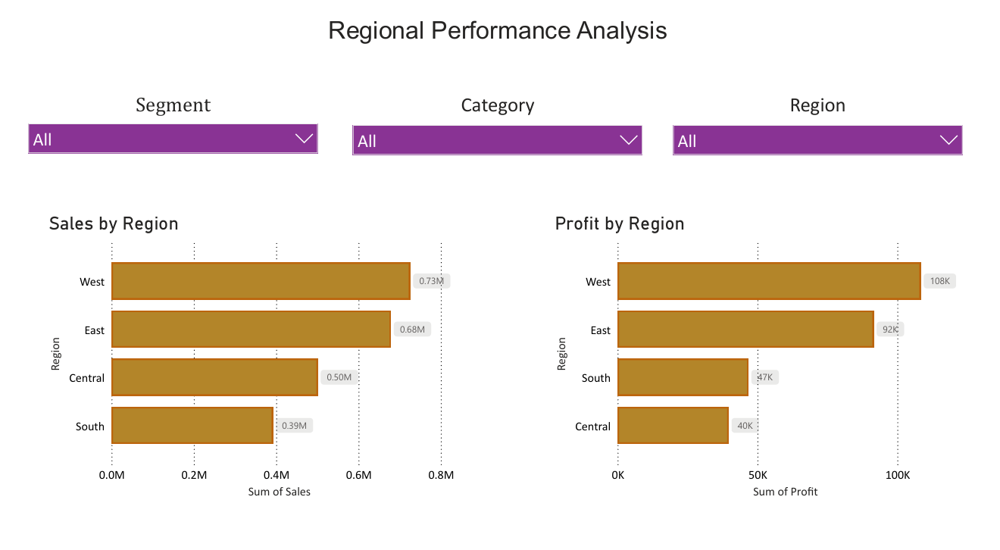

# Retail Sales Performance Dashboard

## Project Overview

This project analyzes retail sales data using Power BI to uncover insights related to sales performance, profitability, product categories, sub-categories, and regional trends. The dashboard provides interactive visualizations to support data-driven decision-making.

## Tools Used

- Power BI
- Microsoft Excel
- DAX Measures
- Data Cleaning & Analysis

## Key Metrics

- Total Sales: 2.30M
- Total Profit: 286.24K
- Total Orders: 10K
- Total Quantity Sold: 38K
- Average Discount: 15.6%

## Dashboard Preview

### Page 1 – Sales Performance Dashboard

### Page 2 – Regional Performance Analysis

## Dashboard Pages

### Page 1: Sales Performance Dashboard

- Sales by Category
- Profit by Category
- Top 5 Sub-Categories by Sales
- Top 5 Sub-Categories by Profit

### Page 2: Regional Performance Analysis

- Sales by Region
- Profit by Region
- Interactive Filters:
  - Segment
  - Category
  - Region

## Key Insights

- Technology generated the highest sales and profit.
- Phones recorded the highest sales among sub-categories.
- Copiers generated the highest profit among sub-categories.
- The West region achieved the highest sales and profit.
- Furniture showed strong sales but relatively lower profit compared to Technology.

## Project Files

- Retail_Sales_Performance_Dashboard.pbix
- Retail_Sales_Performance_Dashboard.pdf
- SampleSuperstore.csv
- SampleSuperstore_Cleaned.csv
- dashboard_page1.png
- dashboard_page2.png

## Author

**Asiya Nissar**

- B.Tech in Computer Science & Engineering
- Advanced Diploma in Artificial Intelligence & Data Science (NSDC Approved)

## Connect With Me

- LinkedIn:  https://www.linkedin.com/in/asiya-n
- GitHub: https://github.com/123asiya123
